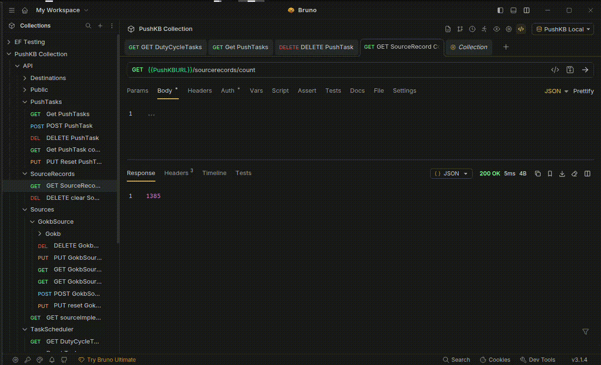

# GOKB -> FOLIO data workflow

This document aims to capture in depth the steps required to set up GOKB data ingest and pushes to FOLIO tenants

## FOLIO Setup

In order to set up a FOLIO environment to accept data from PushKB, a few things are necessary. The current
implementation assumes a running version of mod-agreements from Sunflower or beyond. Whilst some of the endpoints are
available in Ramsons, Sunflower is suggested for what will become version 1.0.0 of PushKB.

- mod-agreements v7.2.x or higher (see above)
	- The environment variable `INGRESS_TYPE=PushKB` set for all instances
		- This will turn off the "harvest" operations
- A system user with permission `erm.pushkb.manage` per tenant that data needs to be pushed to.
	- This permission grants the logged in user access to the `/erm/pushKB*` endpoints, which is one method of ingress for
		data into the local KB.
	- The credentials for these system users will end up being stored in PushKB's secrets vault, and thus granting access
		to FOLIO API for PushKB.

## GOKB set up

PushKB assumes that it is pulling from a GOKB which exposes
the [OpenSearch API](https://github.com/openlibraryenvironment/gokb/wiki/Opensearch-API).

## PushKB configuration steps

Once FOLIO and GOKB are ready to go, it's time to start configuring PushKB via the API. This _assumes_ that PushKB has
been configured to work with a Keycloak authentication and Vault setup as detailed in the README.

### GOKB step

PushKB must first be configured to start pulling data in from GOKB. In order to do this, a `POST` to
`/sources/gokbsource` is required, configuring a `Gokb` object (which is a named GOKB implementation, consisting
of a baseUrl), specific information about the kind of GokbSource in hand, and a name. For basic FOLIO functionality,
BOTH a `PACKAGE` and `TIPP` GokbSource must be created and point at the same Gokb object.

Example POST:

```json
{
	"gokbSourceType": "PACKAGE",
	"gokb": {
		"name": "GOKB_TEST",
		"baseUrl": "https://gokbt.gbv.de"
	},
	"name": "GOKBT_PKG"
}
```

Once both of these are set up (one for PACKAGE and one for TIPP), PushKB will create DutyCycleTask objects for ingesting
the source records. These can be found by hitting the `/dutycycletasks` endpoint, and the response should contain two
tasks like:

```json
{
	"content": [
		{
			"id": "276cc20c-b273-5700-a0f2-0d9f586988ff",
			"taskStatus": "IDLE",
			"reference": "35956c55-6aa1-539a-8c45-27000c4853c5",
			"taskType": "REACTIVE",
			"taskInterval": 3600000,
			"taskBeanName": "IngestScheduledTask",
			"failedAttempts": 0,
			"additionalData": {
				"source": "35956c55-6aa1-539a-8c45-27000c4853c5",
				"source_class": "com.k_int.pushKb.interactions.gokb.model.GokbSource"
			}
		},
		{
			"id": "e8d60bc6-6f02-5773-b8b6-c481c1594d6e",
			"taskStatus": "IDLE",
			"reference": "cbb3858e-c751-5bfa-bc2c-543a2335a673",
			"taskType": "REACTIVE",
			"taskInterval": 3600000,
			"taskBeanName": "IngestScheduledTask",
			"failedAttempts": 0,
			"additionalData": {
				"source": "cbb3858e-c751-5bfa-bc2c-543a2335a673",
				"source_class": "com.k_int.pushKb.interactions.gokb.model.GokbSource"
			}
		}
	],
	"pageable": {
		"size": 1000,
		"number": 0,
		"sort": {
			"orderBy": [
				{
					"ignoreCase": false,
					"direction": "ASC",
					"property": "lastRun",
					"ascending": true
				}
			]
		},
		"mode": "OFFSET"
	},
	"totalSize": 2
}
```

These are the tasks responsible for managing the continuous ingest of source records into the system. While ingesting, a
PushKB will show logs that look something like:

```
17:28:42.460 [reactor-tcp-epoll-10] INFO  c.k.p.i.g.services.GokbFeedService - GokbFeedService::fetchSourceRecords called for GokbSource: GokbSource(id=cbb3858e-c751-5bfa-bc2c-543a2335a673, gokbSourceType=TIPP, gokb=Gokb(id=1098b5bd-c14e-51e2-871a-74b39fb286fa, baseUrl=https://gokbt.gbv.de, name=GOKB_TEST), name=GOKBT_TIPP, pointer=2022-04-28T16:34:09Z, lastIngestStarted=2026-02-18T17:28:42.452757018Z, lastIngestCompleted=null)
17:28:42.462 [reactor-tcp-epoll-10] INFO  c.k.p.i.g.services.GokbFeedService - LOGDEBUG RAN FOR SOURCE(cbb3858e-c751-5bfa-bc2c-543a2335a673, TIPP) AT: 2026-02-18T17:28:42.462856320Z
17:28:42.462 [reactor-tcp-epoll-10] DEBUG c.k.p.i.gokb.GokbApiClient - CHANGEDSINCE: 2022-04-28T16:34:09Z
17:28:42.463 [reactor-tcp-epoll-10] INFO  c.k.p.i.gokb.GokbApiClient - SENDING SCROLL REQUEST WITH CHANGEDSINCE: 2022-04-28T16:34:09Z AND SCROLL ID: null
...
17:29:01.406 [reactor-tcp-epoll-9] INFO  c.k.p.storage.SourceRecordRepository - Record with id(84d0a39c-2449-5431-9eb2-532f7eb049da) already exists, updating
17:29:01.406 [reactor-tcp-epoll-10] INFO  c.k.p.storage.SourceRecordRepository - Record with id(e2120c99-a8e3-5366-9b36-fd8889398ae3) already exists, updating
17:29:01.406 [reactor-tcp-epoll-8] INFO  c.k.p.storage.SourceRecordRepository - Record with id(a0627dde-bd74-561d-bdc3-2dc5f86f856d) already exists, updating
17:29:01.406 [reactor-tcp-epoll-7] INFO  c.k.p.storage.SourceRecordRepository - Record with id(c37ad502-9061-5fc4-b854-c3047cbdd16f) already exists, updating
17:29:01.407 [reactor-tcp-epoll-4] INFO  c.k.p.storage.SourceRecordRepository - Record with id(4dc8b495-4574-56f6-af8b-1edaa33e5cdd) already exists, updating
```

These logs are subject to change. The correct way to see whether a given ingest is happening is to monitor the
DutyCycleTask table and look for `"taskStatus": "IN-PROCESS",`.

#### SourceRecords

A user can check on the ingest to the system by querying the `/sourcerecords/count` endpoint. This can be hit either for
the entire database, for a specific sourceId, or for a sourceId AND a filter on types of records where applicable.
`?filterContext` can be used for the records from a GOKB TIPP source to filter by package UUID.

The expected response will be an integer: `727658` for example. This number will actively increase while an ingest is
occurring. 

### FOLIO step

Once PushKB is pulling data in from GOKB, the next step is to configure the FOLIOs to which data will be pushed. This
can be done by sending a `POST` to `/destinations/foliodestination`. An example body is below:

```json
{
	"destinationType": "PACKAGE",
	"folioTenant": {
		"baseUrl": "https://testing.com",
		"loginUser": "testuser",
		"loginPassword": "testpass",
		"tenant": "test1",
		"authType": "OKAPI",
		"name": "test-tenant"
	},
	"name": "Test FOLIO Destination API"
}
```

This configures a FolioTenant, containing the information about where to access the FOLIO system (which should be the
OKAPI or Kong API gateway addresses, for Okapi and Eureka systems respectively), as well as the given tenant to which
the data should be broadcast, and a login for the system user configured above. With the tenant configured, the other
details are a name for ease of use/reference, as well as a destinationType. For FolioDestinations there are currently
two types, `PACKAGE` and `PCI`. Both of these will need to be configured per tenant as separate records to replace the
harvest functionality.

The response should look like this:

```json
{
	"destinationUrl": "https://testing.com",
	"id": "14ef6976-d96a-51bc-9ca6-6bca2b692223",
	"destinationType": "PACKAGE",
	"folioTenant": {
		"key": "folioTenant/e0aecbc2-a11d-58d3-a88b-e368878052a6",
		"id": "e0aecbc2-a11d-58d3-a88b-e368878052a6",
		"baseUrl": "https://testing.com",
		"tenant": "test1",
		"name": "test-tenant",
		"loginUser": "testuser",
		"authType": "OKAPI"
	},
	"name": "Test FOLIO Destination API"
}
```

#### FolioTenant credentials

The credentials for the FolioTenant are stored in Vault. See the README for more specifics on configuration. You will
notice however that the password is not returned through API calls. This is by design. The password can be changed via
PUT to the folioTenant endpoint, but there is currently no way for an end user to see the configured credentials without
going to the Vault interface itself. The credentials for the FolioTenant above are stored at the specified `key`:
`folioTenant/e0aecbc2-a11d-58d3-a88b-e368878052a6`.

### Transform "step"

PushKB is configured such that in theory it could be set up to pull from any Source, and push to any Destination. In
order to allow for this, the SourceRecords are stored in a cache in the exact form they are sent, and it is the
responsibility of a `Transform` to handle the transformation to a shape accepted by a Destination's API.

Eventually the goal is for these to be configurable by a user, but for now there are 2 hardcoded examples:
`GOKb_TIPP_to_PCI_V1` and `GOKb_Package_to_Pkg_V1`. (The V1 in the title is currently the only versioning supported,
there will eventually be systems in place to more properly version transforms). These are both examples of
`ProteusTransform` objects, a `JSON_TO_JSON` transformation spec using `Proteus`, an open source extension of the
JSONPath standard.

In order to see these, make a `GET` to the `/transforms/proteustransform` endpoint. The response should look like:

```json
{
	"content": [
		{
			"type": "JSON_TO_JSON",
			"id": "fd1d7dd4-5e2f-5449-98b5-5917f9ee55c9",
			"name": "GOKb_TIPP_to_PCI_V1",
			"slug": "GOKb_TIPP_to_PCI_V1",
			"source": "STRING_SPEC",
			"spec": {
				"//": "This will contain a JSONPath-esque schema object"
			}
		},
		{
			"type": "JSON_TO_JSON",
			"id": "2129eed6-166f-5a40-832e-510d7f2781d9",
			"name": "GOKb_Package_to_Pkg_V1",
			"slug": "GOKb_Package_to_Pkg_V1",
			"source": "STRING_SPEC",
			"spec": {
				"//": "This will contain a JSONPath-esque schema object"
			}
		}
	],
	"pageable": {
		"size": 1000,
		"number": 0,
		"sort": {},
		"mode": "OFFSET"
	},
	"totalSize": 2
}
```

These two are the configurations required for this workflow.

### PushTask step

There is only one configuration step left to get up and running pushing data to Folio, namely to configure the "
PushTask" objects which connect a "source" to a "Destination".

There will need to be one of these per Source/Destination pair, so 2 for Gokb -> Folio functionality currently.

A PushTask can be configured by sending a `POST` to `/pushtasks`, with a body such as:

```json
{
	// The relevant proteus transformation
	"transformId": "2129eed6-166f-5a40-832e-510d7f2781d9",
	"transformType": "com.k_int.pushKb.transform.model.ProteusTransform",
	// The GOKB Source (PKG or TIPP)
	"sourceType": "com.k_int.pushKb.interactions.gokb.model.GokbSource",
	"sourceId": "35956c55-6aa1-539a-8c45-27000c4853c5",
	// The FOLIO Destination (PACKAGE OR PCI)
	"destinationType": "com.k_int.pushKb.interactions.folio.model.FolioDestination",
	"destinationId": "704ea032-920d-5a82-abaf-674e4449bf36"
}
```

The `destinationId` and `sourceId` should be obtainable via the work performed earlier to configure their respective
entities. The `transformId` is a little different, see above for details on how to obtain the relevant identifier.

This should return a body of shape:

```json
{
	"pushableId": "e3a02ea1-3fbe-53f5-b654-13c8cb430e68",
	"id": "e3a02ea1-3fbe-53f5-b654-13c8cb430e68",
	"transformId": "2129eed6-166f-5a40-832e-510d7f2781d9",
	"transformType": "com.k_int.pushKb.transform.model.ProteusTransform",
	"sourceId": "35956c55-6aa1-539a-8c45-27000c4853c5",
	"sourceType": "com.k_int.pushKb.interactions.gokb.model.GokbSource",
	"destinationId": "704ea032-920d-5a82-abaf-674e4449bf36",
	"destinationType": "com.k_int.pushKb.interactions.folio.model.FolioDestination",
	"destinationHeadPointer": "1970-01-01T00:00:00Z",
	"lastSentPointer": "1970-01-01T00:00:00Z",
	"footPointer": "1970-01-01T00:00:00Z"
}
```

#### Pointer logic

The `destinationHeadPointer`, `lastSentPointer` and `footPointer` work in tandem to deliver the latest changes to GOKB
first, without losing any updates along the way. The `footPointer` is the latest update before which _all_ updates had
been confirmed successfully sent to FOLIO, so if records from 2018 back through to 2003 had _all_ successfully been
sent, but some records after 2018 had not yet, the `footPointer` would be at 2018. The `destinationHeadPointer` is the
latest update that has been confirmed sent to FOLIO full stop, so if there are some 2024 records that got sent but some
2025 records which had not, this pointer would be at 2024. Finally the `lastSentPointer` is the earliest record sent
between the `destinationHeadPointer` and the `footPointer`. In this way the service will attempt to send the newest
changes first, and "zip up" to the last known sent records. If this fails, the next retry will continue where it left
off until the "zip" in finished, and then the algorithm will return to the top of the stack.

```mermaid
stateDiagram-v2
	direction TB
	state "State 1: Identifying a Gap" as S1
	state "State 2: Zipping Downwards" as S2
	state "State 3: New Records Arrive" as S3
	state "State 4: Gap Closed" as S4
	state "State 5: Jump to New Head" as S5
	[*] --> S1
	S1 --> S2: Start Processing
	S2 --> S3: GOKB Ingest runs in background
	S3 --> S4: All records in gap sent
	S4 --> S5: Promote Foot Pointer
	S5 --> S2: Start new Zip
	note right of S1
		<b>RECORDS IN DB:</b> [R10, R9, R8...R1]
		<b>POINTERS:</b>
		• destinationHeadPointer: R10
		• lastSentPointer: R10
		• footPointer: R03
		<i>The "Gap" is records 4 through 9.</i>
	end note
	note right of S2
		<b>POINTERS:</b>
		• destinationHeadPointer: R10
		• lastSentPointer: R07
		• footPointer: R03
		<i>Pushed R9, R8, R7. The zipper is moving DOWN.</i>
	end note
	note right of S3
		<b>RECORDS IN DB:</b> [R13, R12, R11, R10...R1]
		<b>POINTERS:</b>
		• destinationHeadPointer: R10
		• lastSentPointer: R05
		• footPointer: R03
		<i>New records exist (R11-13), but we finish
		the current zip (R5, R4) first.</i>
	end note
	note right of S4
		<b>POINTERS:</b>
		• destinationHeadPointer: R10
		• lastSentPointer: R03
		• footPointer: R03
		<i>LSP has touched the Foot. The gap is gone.</i>
	end note
	note right of S5
		<b>RECORDS IN DB:</b> [R13...R1]
		<b>POINTERS:</b>
		• destinationHeadPointer: R13
		• lastSentPointer: R13
		• footPointer: R10
		<i>DHP jumps to R13. FP promoted to R10.
		A new gap (11, 12) is now ready to zip.</i>
	end note
```



#### PushTask DutyCycleTasks

With the PushTasks configured, there should be new DutyCycleTasks in the system. Hitting the same endpoint as earlier
should now yield something like:

```json
{
	"content": [
		{
			"id": "295b64f8-b30d-5f74-ba2e-7c160e31851c",
			"taskStatus": "IDLE",
			"reference": "881e0234-ac26-5eee-81f7-84ab9b072206",
			"taskType": "REACTIVE",
			"lastRun": "2026-03-02T15:36:17.082139Z",
			"taskInterval": 3600000,
			"taskBeanName": "PushableScheduledTask",
			"failedAttempts": 0,
			"lastAttempted": "2026-03-03T15:26:34.428606Z",
			"additionalData": {
				"pushable": "881e0234-ac26-5eee-81f7-84ab9b072206",
				"pushable_class": "com.k_int.pushKb.model.PushTask"
			}
		},
		{
			"id": "e8d60bc6-6f02-5773-b8b6-c481c1594d6e",
			"taskStatus": "IDLE",
			"reference": "cbb3858e-c751-5bfa-bc2c-543a2335a673",
			"taskType": "REACTIVE",
			"lastRun": "2026-03-03T15:25:54.746365Z",
			"taskInterval": 3600000,
			"taskBeanName": "IngestScheduledTask",
			"failedAttempts": 0,
			"additionalData": {
				"source": "cbb3858e-c751-5bfa-bc2c-543a2335a673",
				"source_class": "com.k_int.pushKb.interactions.gokb.model.GokbSource"
			}
		},
		{
			"id": "276cc20c-b273-5700-a0f2-0d9f586988ff",
			"taskStatus": "IDLE",
			"reference": "35956c55-6aa1-539a-8c45-27000c4853c5",
			"taskType": "REACTIVE",
			"lastRun": "2026-03-03T15:26:05.000922Z",
			"taskInterval": 3600000,
			"taskBeanName": "IngestScheduledTask",
			"failedAttempts": 0,
			"additionalData": {
				"source": "35956c55-6aa1-539a-8c45-27000c4853c5",
				"source_class": "com.k_int.pushKb.interactions.gokb.model.GokbSource"
			}
		},
		{
			"id": "023029c3-9bf3-50a2-9d6f-b695b5df58da",
			"taskStatus": "IDLE",
			"reference": "5c99a8b1-c7fc-5e11-a17f-59a2a9257857",
			"taskType": "REACTIVE",
			"taskInterval": 3600000,
			"taskBeanName": "PushableScheduledTask",
			"failedAttempts": 0,
			"lastAttempted": "2026-03-03T15:25:44.420791Z",
			"additionalData": {
				"pushable": "5c99a8b1-c7fc-5e11-a17f-59a2a9257857",
				"pushable_class": "com.k_int.pushKb.model.PushTask"
			}
		}
	],
	"pageable": {
		"size": 1000,
		"number": 0,
		"sort": {
			"orderBy": [
				{
					"ignoreCase": false,
					"direction": "ASC",
					"property": "lastRun",
					"ascending": true
				}
			]
		},
		"mode": "OFFSET"
	},
	"totalSize": 4
}
```

While pushing, PushKB should surface logs that look something like this:

```

15:59:58.930 [multithreadEventLoopGroup-7-1] INFO  c.k.p.i.f.s.FolioDestinationApiService - WHAT IS RESP? {"message":"pushPci successful","statusCode":200,"pushPCIResult":{"success":true,"startTime":1772553595180,"titleCount":991,"newTitles":0,"removedTitles":0,"updatedTitles":0,"updatedAccessStart":0,"updatedAccessEnd":0,"nonSyncedTitles":991,"updateTime":1772553598924}}
15:59:58.953 [reactor-tcp-epoll-6] INFO  c.k_int.pushKb.services.PushService - 492704 records remaining in this queue
15:59:58.956 [reactor-tcp-epoll-6] INFO  c.k_int.pushKb.services.PushService - UPPER BOUND: 2026-03-03T15:44:20.040078Z
15:59:58.956 [reactor-tcp-epoll-6] INFO  c.k_int.pushKb.services.PushService - LOWER BOUND: 2026-03-03T15:40:56.877218Z
15:59:58.979 [reactor-tcp-epoll-6] INFO  c.k_int.pushKb.services.PushService - PushService::runPushableRecursive with 492704 records in queue
15:59:59.013 [reactor-tcp-epoll-10] INFO  c.k_int.pushKb.services.PushService - PushService::processAndPushRecords called with 1000 records
16:00:00.320 [reactor-tcp-epoll-10] INFO  c.k_int.pushKb.services.PushService - Pushing records 2026-03-03T15:44:19.709246Z -> 2026-03-03T15:44:20.039852Z
16:00:01.508 [scheduled-executor-thread-50] DEBUG c.k.t.s.ReactiveDutyCycleTaskRunner - ReactiveDutyCycleTaskRunner::Task interval is set to: PT10S
16:00:01.508 [scheduled-executor-thread-50] DEBUG c.k.t.s.ReactiveDutyCycleTaskRunner - ReactiveDutyCycleTaskRunner::Concurrent runners: 2
16:00:01.508 [scheduled-executor-thread-50] DEBUG c.k.t.s.ReactiveDutyCycleTaskRunner - ReactiveDutyCycleTaskRunner::executeNextTask
16:00:01.508 [scheduled-executor-thread-50] DEBUG c.k.t.s.ReactiveDutyCycleTaskRunner - Take next task for runtime 2026-03-03T16:00:01.508773256Z
16:00:04.262 [multithreadEventLoopGroup-7-1] INFO  c.k.p.i.f.s.FolioDestinationApiService - WHAT IS RESP? {"message":"pushPci successful","statusCode":200,"pushPCIResult":{"success":true,"startTime":1772553600347,"titleCount":1000,"newTitles":0,"removedTitles":0,"updatedTitles":0,"updatedAccessStart":0,"updatedAccessEnd":0,"nonSyncedTitles":1000,"updateTime":1772553604256}}
16:00:04.285 [reactor-tcp-epoll-10] INFO  c.k_int.pushKb.services.PushService - 491704 records remaining in this queue
16:00:04.288 [reactor-tcp-epoll-10] INFO  c.k_int.pushKb.services.PushService - UPPER BOUND: 2026-03-03T15:44:19.709246Z
16:00:04.288 [reactor-tcp-epoll-10] INFO  c.k_int.pushKb.services.PushService - LOWER BOUND: 2026-03-03T15:40:56.877218Z
16:00:04.320 [reactor-tcp-epoll-10] INFO  c.k_int.pushKb.services.PushService - PushService::runPushableRecursive with 491704 records in queue
```

These are very much subject to change, as before it is most prudent to check the DutyCycleTask for `IN-PROCESS`.

## Workflow

At this stage, PushKB _should_ be set up to work and need no further configuration. DutyCycleTasks will spin up and shut
down and perform PushTasks and IngestTasks and PushKB will manage the interactions between source and destination.
However, as ever, things _can_ go wrong. See the README for information on handling failures.
