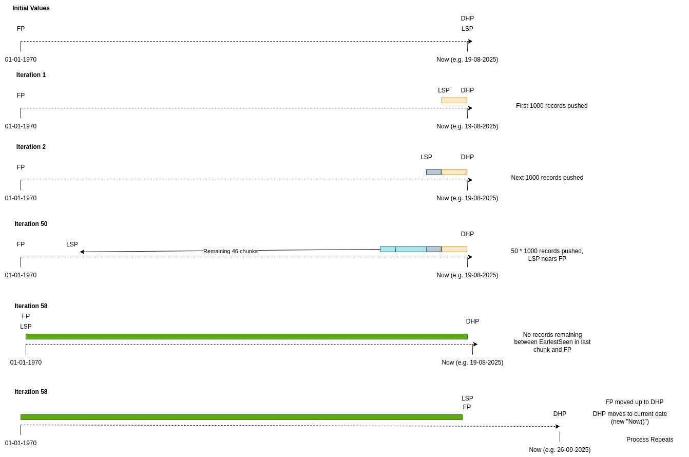
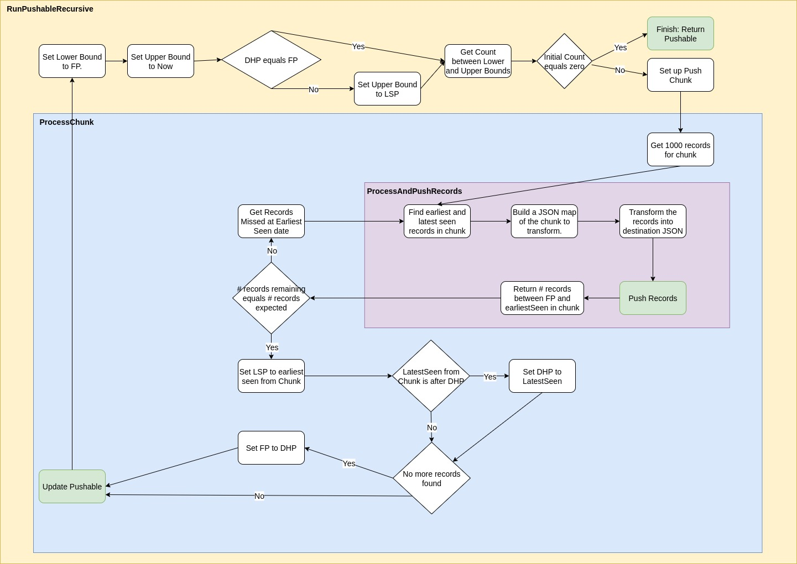

# PushKB Documentation
Last updated 25/09/25

## Running PushKB in development

PushKB needs `mod-agreements` to be running locally so it has a destination to “push” to. Run `mod-agreements` by navigating to `/tools/testing/` and running `docker compose up`. Then run `./gradlew bootRun` with environment variable `INGRESS_TYPE=PushKB`, and finally run the `drop_tenant.sh` script on port 8080.

PushKB also depends on various services, so navigate to the `/pushkb/infrastructure` folder and run `docker compose up`. Run the pushkb application using `./gradlew run` from the root directory. The `'export TASKSCHEDULER_REACTIVE_CONCURRENCY=1; '` environment variable can be used to increase the number of PushKB runners. For example, you can run PushKB with `'export TASKSCHEDULER_REACTIVE_CONCURRENCY=3; ./gradlew run'` to start PushKB with 3 runners.

## Context

The goal of PushKB is to reliably push a large and continuously growing dataset from a source to a destination without missing any records, without overwhelming memory, and while prioritizing the most recent data.

If we imagine a long timeline of records:

<-- OLDER DATA (PAST) ------------------------------------ NEWER DATA (PRESENT) -->

We have a “footPointer” which represents the earliest point in the graph we have sent records from.
We have a `destinationHeadPointer` which represents the newest record we have sent.
We have a `lastSentPointer` which represents the oldest record we sent in the most recent chunk of data we processed. This is like a “bookmark”.

The pointers are represented by timestamps. Hence, differences between them don’t represent numbers of records, but gaps in time.

The `lastSentPointer` (LSP) will work back towards the `footPointer` (FP) from the `destinationHeadPointer` (DHP). Eventually, we will have pushed all the records found between the DHP and the FP in chunks of 1000 at a time. After this process is complete, we can move the FP up to the DHP, and move the DHP forward to the current date. Therefore the FP always represents the date before which we know we have already pushed all records.

### Example



**Initial State:**
We've just finished ingesting all records up to `2023-01-01 12:00:00`.
Therefore, `footPointer = 2023-01-01 12:00:00`
And `destinationHeadPointer = 2023-01-01 12:00:00`

`DHP == FP?` Yes.

The code will look for records where `updated` is between FP (the `lowerBound`, `2023-01-01`) and `Instant.now()` (the `upperBound`, let's say it's `2024-05-23 15:00:00`).

The database is queried and fetches the 1000 newest records that have not yet been sent. The value of 1000 records per chunk is currently hardcoded into the database queries.

If you have a large backlog of historical data for a new PushKB instance, these 1000 records will be the absolute newest ones. Their timestamps will be very recent.
The newest record in this chunk (`latestSeen`) might have an updated timestamp of `2024-05-23 14:59:59`.
The oldest record in this same chunk (`earliestSeen`) might have an updated timestamp of `2024-05-23 14:58:30`.

Hence, at the beginning of the process, the records “updated” fields will be closer to the DHP timestamp, than the footPointer's timestamp of `2023-01-01`.

**Update the Pointers:**
Update `destinationHeadPointer`: `psh.setDestinationHeadPointer(latestSeen)`.
DHP is now set to `2024-05-23 14:59:59`. It has jumped forward more than a year in time!
Update `lastSentPointer`: `psh.setLastSentPointer(earliestSeen)`.
LSP is now set to `2024-05-23 14:58:30`.
`footPointer` is UNCHANGED: It remains at `2023-01-01 12:00:00`.

There’s now a gap in our timeline:
`[FP] . . . . . . [LSP] . . . . . [DHP]`

When we process a chunk, this gap between the FP and the LSP of unprocessed records gets smaller:
`[FP] . . . [new LSP] . . . . .[DHP] . . . . . . . [actual head]`

If the “latestSeen” record in a chunk is after the current DHP, we update the DHP to this value [Note: would this ever happen?]. But usually, the DHP will remain at its current time after each repetition until we break out of the recursion.

If the DHP doesn’t equal the FP yet, then we continue processing chunks by passing in the new LSP as the upper bound, and the FP as the lower bound.

`[FP][new LSP] . . . . .[DHP] . . . . . . . [actual head]`

Eventually, there will be no records found before the earliest date in a chunk after processing a chunk. So when the final chunk from the gap is processed, the service will find there are 0 records remaining (`remainingCount2 == 0`) and performs the final "zip up":
`psh.setFootPointer(psh.getDestinationHeadPointer())`
This moves the FP all the way to the DHP, closing the gap. The system is now back at the start ready to look for new records again.

## PushService Flow



### `runPushable()`
Accepts a `Pushable`, which are implemented as `PushTask` and `TemporaryPushTask`. `PushTasks` contain the pointers (FP, LSP, DHP) tracking where in the pull process we are, the source, the destination and the type of transform.

It returns a `Pushable Mono`.

### `getPushableTuple()`
`runPushable()` calls `getPushableTuple()` on the pushable, which might better be called “getPushableContext”. `getPushableTuple` gathers the source and destination on the pushable, then gets the destination client, saves the session (`pushSession`) information and returns a `tuple4` containing the source, destination, client and session. This information is then used to call `runPushableRecursive()`.

### `runPushableRecursive()`
`runPushableRecursive()` processes 1000 records then calls itself again. Each recursive call sets the upper and lower bounds from which to fetch records. The lower bound defaults to the foot pointer, and the upper bound to ‘now’. If we’re still zipping up a gap (as per the algorithm above), the destination head pointer will not be equal to the foot pointer, and in this case we set the upper bound to the last seen pointer. This means we’ll be “starting from” the earliest record we pushed in the last chunk.

`runPushableRecursive` checks the number of records left in the entire queue between the upper bound and lower bound (which is the foot pointer), by calling `sourceRecordDatabaseService.countFeed()`. If there are zero, we’ve reached the end of the queue, but otherwise, we call `setUpPushChunk()` with the session information and taking the resulting `pushChunk`, process it with `processChunk()` then call `runPushableRecursive()` again on the pushable returned from `processChunk()`. This ensures we keep fetching and pushing chunks until we’ve reached the foot pointer and there are no records left.

### `processChunk()` 
When processing a chunk, 1000 source records are retrieved using the pushable, and the upper and lower bounds. The list of 1000 source records is then passed into `processAndPushRecords()` (described below). `ProcessAndPushRecords()` returns a tuple containing the `earliestSeen` date, `latestSeen` date and `remainingCount` from the chunk. These values are then used to check if we have missed any records. If not, we just send them onto the next `flatMap()`, which sets the LSP to the `earliestSeen` date, and if the `latestSeen` date is after the DHP, we set the DHP to that date.

Importantly, if there are no more records remaining (the record count is zero), we set the DHP to the FP, which effectively finishes the process of pulling records in from the current gap.

We then return the updated pushable.

`ProcessChunk` uses its own transaction, so if a chunk fails part way through, we roll back the entire chunk’s worth of records. This is so that we don’t end up with a gap where we think we’ve pushed some number of remaining records in that chunk and continue down to the foot pointer.

### `processAndPushRecords()` 
`processAndPushRecords()` initially takes the `sourceRecordsChunk` and reduces it into a tuple of three items. These are the `earliestSeen`, `latestSeen` and a JSON object containing all the source records in the chunk.

The `reduce()` method is used to accumulate all the source records into this one tuple object, and iteratively compares when source records were last updated to decide the `earliestSeen` and `latestSeen` values.

This tuple is then taken and the records list is used to create a json object alongside some other metadata from the `pushService` [code]. Still within `processAndPushRecords`, the `transformService` is called using the records, which will transform records from one JSON structure to another.

The remainder of the method takes the transformed records and pushes them to the destination, before returning a tuple containing the earliest and latest seen dates, and the number of records remaining in the queue before the earliest seen record in the chunk [code].

After processing the records, there’s a check to see if we missed any records. “Missing records” can occur because if we fetch 1000 records between two dates, then there might be multiple records present at that earliest date. After processing the chunk, we then count the number of records occurring before (but not including) the `earliestSeen` date and the foot pointer. Hence, we expect there to be 1000 less records than previously, but we might see that there are 1002 less, if there were 2 additional records with the same `lastUpdated` time as the earliest one in the chunk. We then need to push those two records at the `earliestSeen` date again.

After processing the chunk, we can then move the `lastSentPointer` (LSP) “leftwards” by setting it to the `earliestSeen` date from the chunk's records.

We also have a check to say “if the `LatestSeen` date in the chunk is AFTER the DHP, then move the DHP ‘rightwards/forwards in time’ to the `LatestSeen` date. But in practice, I’m not sure when this scenario would happen.

If the `remainingCount` is zero, the `footPointer` can be moved up to the `destinationHeadPointer`, which progresses the ‘base’ of the record queue forward in time.

## Depends on these services…

*   **`sourceRecordDatabaseService`**
    *   `countFeed()`
    *   `getSourceRecordFeed()`
    *   `getSourceRecordFeedForUpdate()`
*   **`pushSessionDatabaseService`**
    *   `save()`
*   **`pushChunkDatabaseService`**
    *   `save()`
*   **`transformService`**
    *   `findById()`
    *   `transformJsonToJson()`

The `pushable` holds the transform type and and transform id, which can be used to fetch a `TransformImplementationService` for that type and id. This is needed to call `transformJsonToJson`, where we again pass in the transform type, the `TransformImplementationService` returned from before, and in this case a JSON object which stores all the records from the pull.

A slug is used to describe the transform, for example: `"GOKb_TIPP_to_PCI_V1"`, or `"GOKb_Package_to_Pkg_V1"`. Then, in the `spec` field, we store the actual transform, which is of type `jsonb` written in Proteus: e.g.
```json
{
  "chunkId": "$.chunkId",
  "records": {
    "spec": {
      "url": "$.url",
      "title": "$.name",
      // ...
    }
  }
}
```

Currently, the code only has the ability to transform Json to Json [code].

An entire chunk of records is transformed at once, so the “transformedRecord” variable which is output from the `transformService` is actually a large Json batch of many records.

After the transformation, all we need to do is push the transformed records to the destination (our FOLIO instance).

*   **`destinationService`**
    *   `push()`
    *   `getClient()`

*   **`pushableService`**
    *   `getSourceAndDestination()`
    *   `update()`

## Destinations and Sources

The destination is usually a FOLIO tenant, and we create an HTTP client to push to that tenant.

The source is usually GoKB.

The source and destination are currently hardcoded in the application config and bootstrapped in when running PushKB locally.

```yaml
sources:
  gokbs:
    -
      name: GOKB
      url: https://gokbt.gbv.de
  gokbsources:
    -
      name: GOKB_PKG
      gokb: GOKB
      type: PACKAGE
    -
      name: GOKB_TIPP
      gokb: GOKB
      type: TIPP

destinations:
  foliotenants:
    -
      name: DOCKER_COMPOSE_LOCAL_TENANT
      authtype: NONE
      tenant: test1
      baseurl: http://localhost:8080
  foliodestinations:
    -
      name: FOLIO_PACKAGE
      foliotenant: DOCKER_COMPOSE_LOCAL_TENANT
      destinationtype: PACKAGE
    -
      name: FOLIO_PCI
      foliotenant: DOCKER_COMPOSE_LOCAL_TENANT
      destinationtype: PCI
```

A destination has an ID, name and URL. The `FolioDestination` class, which is the implementation we use, also has a `destinationType` and a `folioTenant` field. The `destinationType` can be `PACKAGE` or `PCI`. The `folioTenant` stores information about a FOLIO instance and tenant (e.g. login information etc…).

We can interact with the destination using the `FolioDestinationApiService`, or the `FolioDestinationDatabaseService`.

The `ApiService` implements `getClient()` and `push()` methods. `getClient` creates a Micronaut http client using the destination URL, then taking this client and the destination’s tenant, creates and returns an instance of class `FolioApiClient`. `FolioApiClient` contains various paths used to hit the PushKB endpoints of a running FOLIO module, as well as a cookie token for logging into the tenant. The `FolioApiClient` has methods for logging into a FOLIO tenant, making requests, and ultimately pushing PCIs or Packages as part of PushKB.

The `sourceService` can be used to register a (reactive) ingest task by calling `ensureSource()`, which registers the task of name “`IngestScheduledTask`”. When an `ingestScheduledTasks run()` method is called, it will find the source instance for the task and call `triggerIngestForSource()` on that source.

`triggerIngestForSource()` creates an instance of type `sourceFeedService` and `sourceDatabaseService`. These are both interfaces. The `sourceFeedService` interface only has one method on it, `fetchSourceRecords()`. We have a `GoKBFeedService` class that implements this method.

## Testing

Tests run using Micronaut Test Resources, which should only spin up containers for test tasks. 
This means that you should _not_ need to have the`infrastructure/docker-compose` file (with keycloak config) up and running for the tests to pass.

Task scheduling tests are independent and can be found in the `taskscheduler` module.
