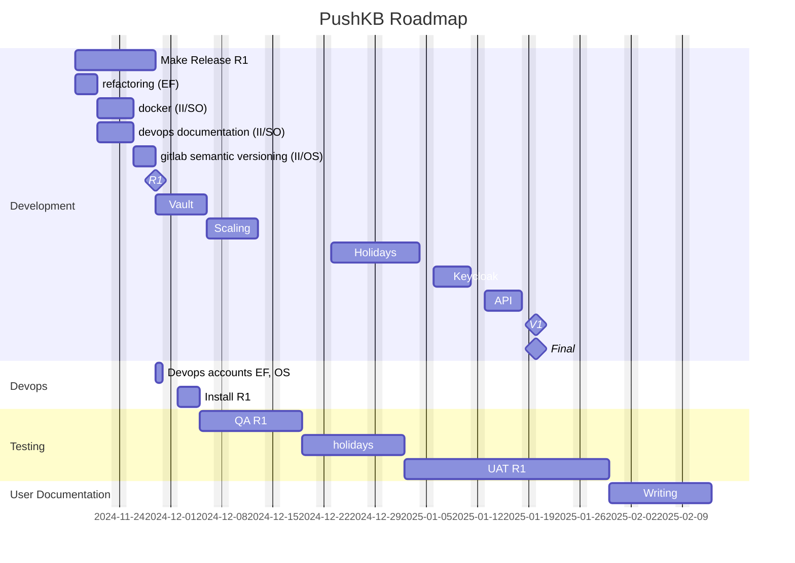

PushHB Roadmap - Last updated II 16th Nov 2024

```mermaid
gantt
    title PushKB Roadmap
    dateFormat  YYYY-MM-DD
    excludes    weekends

    section Development
    Make Release R1                    :t3-0, 2024-11-18, 9d
    refactoring (EF)                   :t3-0-1, 2024-11-18, 3d
    docker (II/SO)                     :t3-0-2, after t3-0-1, 3d
    devops documentation (II/SO)       :t3-0-3, after t3-0-1, 3d
    gitlab semantic versioning (II/OS) :t3-0-4, after t3-0-3, 3d
    R1                                 :milestone, after t3-0, 0d
    Vault                              :t3-1, after t3-0, 5d
    Scaling                            :t3-2, after t3-1, 5d
    Holidays                           :thols1, 2024-12-23, 10d
    Keycloak                           :t3-3, after thols1, 5d
    API                                :t3-4, after t3-3, 5d
		V1                                 :milestone, after t3-4, 0d
		Final                              :milestone, 2025-01-20, 0d

    section Devops
    Devops accounts EF, OS             :t4-1, after t3-0, 1d
    Install R1                         :t4-2, after t4-1, 3d

    section Testing
    QA R1                              :t5-1, after t4-2, 10d
    holidays                           :t5-2, after t5-1, 10d
    UAT R1                             :t5-3, after t5-2, 20d

    section User Documentation
    Writing                            :t6-1, after t5-3, 10d

```

